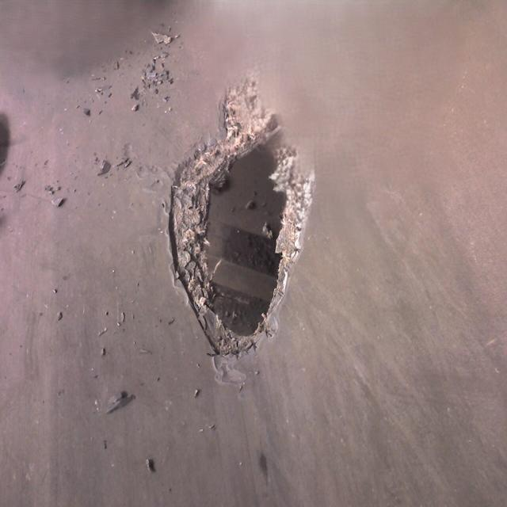
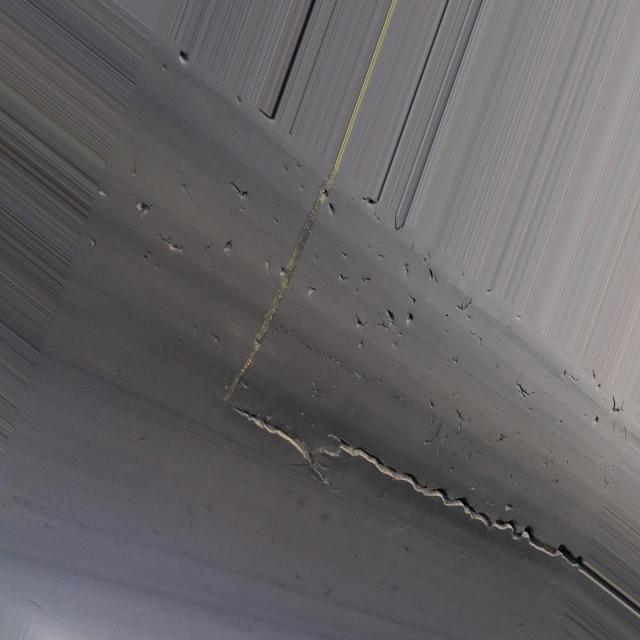
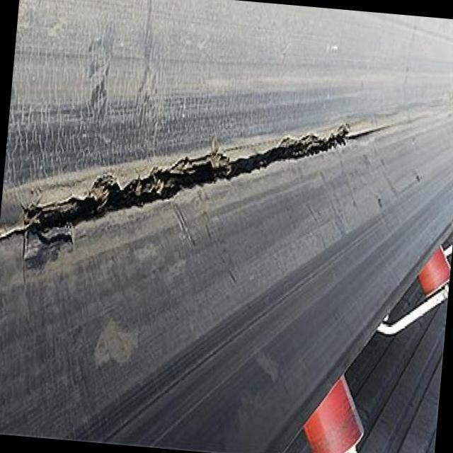
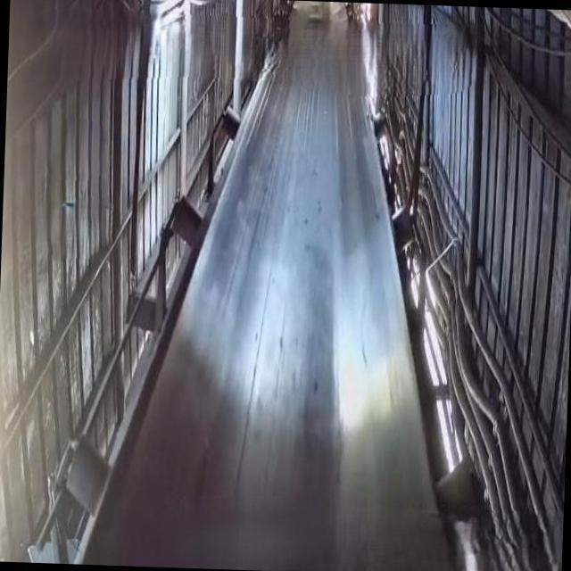

# 📂 Dataset 
Descripción breve del dataset (conjunto de datos) utilizado:  
- Origen: público
- Cantidad de imágenes totales: 2312
- Carpeta de imágenes y etiquetas basados en formato YOLO v11.
- Estructura de carpetas (train, val, test)  

Link de dataset en Roboflow: https://app.roboflow.com/u-rcs0d/conveyor-belt-damage-detection-y6dxf/browse?queryText=&pageSize=50&startingIndex=0&browseQuery=true

## 📂 Estructura de datos (basado en YOLO v11)

El dataset sigue el formato estándar de YOLO v11, organizado en dos carpetas principales:

```bash
dataset/
├── images/
│   ├── train/
│   ├── val/
│   └── test/
└── labels/
    ├── train/
    ├── val/
    └── test/
```
## 📂 Etiquetado de datos (labels)

Las clases a utilizar (fallas) se describen en el siguiente vector de clases:
```yaml
Standard_Classes: ['Hole', 'Impact Damage', 'Puncture', 'Tear', 'Wear']
Null == Good (considerando que la ausencia de fallas es estado sano)
```
## 📦 Formato de Etiquetado (YOLO v11)

Este proyecto utiliza etiquetado en formato YOLO v11 para detección de objetos.
Las etiquetas de cada imagen se almacenan en archivos .txt con el mismo nombre que la imagen y contienen, por línea, la información de cada objeto detectado.

### 📝 Vector de etiquetado  
Cada línea representa **un objeto** con el vector:

```text
<class_id> <x_center> <y_center> <width> <height>
```

- `class_id` → Entero (0,1,2,3,4). Cada `class_id` corresponde a la línea (index) en `Standard_classes` (empezando en 0).  
- `x_center`, `y_center`, `width`, `height` → Valores normalizados en [0,1]. `x_center` e `y_center` indican las coordenadas del centro del cuadro delimitador en el plano X-Y, mientras que `width` y `height` representan su ancho y alto relativos al tamaño total de la imagen respecto al punto central (`x_center`, `y_center`).


---
<p align="center">
  
</p>


‼️Los formatos de datos antes mencionados serán adaptados según el modelo a utilizar mediante un script de modificación de formato de datos.


## 🖼️ Ejemplos de fallas que contiene el dataset

El dataset filtrado y post-procesado, contiene 6 tipos de clases: 5 fallas y una sana. A continuación se muestran ejemplos de cada falla que contiene el dataset.

<table align="center">
  <tr>
    <td align="center">
      <b>Hole (Agujero)</b><br>
      
    </td>
    <td align="center">
      <b>Impact Damage (Daño por impacto)</b><br>
      
    </td>
    <td align="center">
      <b>Puncture (Perforación(es))</b><br>
      
    </td>
  </tr>
  <tr>
    <td align="center">
      <b>Tear (Desgarro)</b><br>
      
    </td>
    <td align="center">
      <b>Wear (Abrasión)</b><br>
      
    </td>
    <td align="center">
      <b>Sin fallas (Saludable)</b><br>
      
    </td>
  </tr>
</table>

