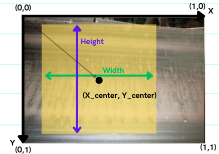
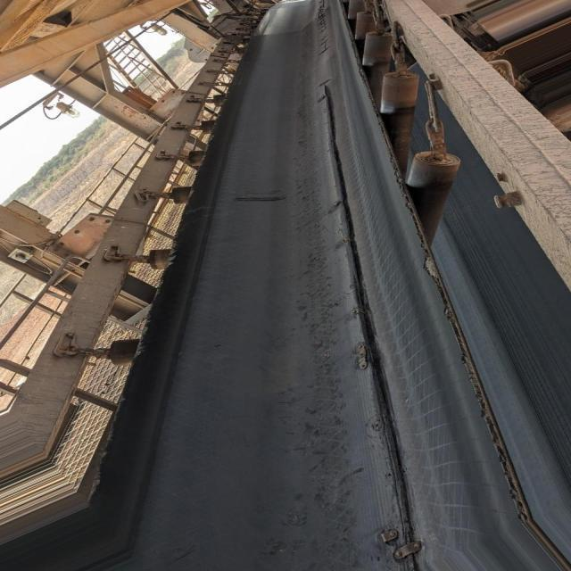

# 📂 Dataset 
Descripción breve del dataset (conjunto de datos) utilizado:  
- Origen: público
- Cantidad de imágenes totales: 2312
- Resolución de imágenes: 640x640px
- N° de clases (N° de fallas): 5
- Partición de datos: entrenamiento (train), validación (valid) y testeo (test)

🔍Para visualizar el dataset mediante una interfaz de opencv, ejecutar el siguiente script en la terminal:

```bash
python Dataset/view_dataset.py
```

📝(Opcional) Se recomienda ejecutar el siguiente script en la terminal para estandarizar el nombre de las imágenes y etiquetas:

```bash
python Dataset/rename_dataset.py
```
## 📂 Estructura de datos

El dataset sigue el formato estándar de YOLO v11, organizado en tres carpetas principales:

```bash
dataset/
├── test/
│   ├── images/
│   └── labels/
├── train/
│   ├── images/
│   └── labels/
├── valid/
│   ├── images/
│   └── labels/
└── data.yaml

```

La carpeta `ìmages` contiene imágenes con registros de fallas de correas transportadoras, mientras que la carpeta `labels` contiene las etiquetas correspondientes con las clases presentes en la imagen de mismo nombre.
## 📂 Etiquetado de datos (labels)

Las clases a utilizar (fallas) se describen en el siguiente vector de clases:
```yaml
Standard_Classes: ['Hole', 'Impact Damage', 'Puncture', 'Tear', 'Wear']
Null == Good (considerando que la ausencia de fallas es estado sano)
```
Estas se encuentran dentro del archivo `data.yaml`.

## 📦 Formato de Etiquetado

Este proyecto utiliza por simplicidad el etiquetado en formato YOLO v11 para detección de objetos.
Las etiquetas de cada imagen se almacenan en archivos .txt con el mismo nombre que la imagen y contienen, por línea, la información de cada objeto detectado.

### 📝 Vector de etiquetado  
Cada línea representa **un objeto** con el vector:

```text
<class_id> <x_center> <y_center> <width> <height>
```

- `class_id` → Entero (0,1,2,3,4). Cada `class_id` corresponde a la línea (index) en `Standard_Classes` (empezando en 0).  
- `x_center`, `y_center`, `width`, `height` → Valores normalizados en [0,1]. `x_center` e `y_center` indican las coordenadas del centro del cuadro delimitador en el plano X-Y, mientras que `width` y `height` representan su ancho y alto relativos al tamaño total de la imagen respecto al punto central (`x_center`, `y_center`).


---
<p align="center">
  
</p>


‼️Los formatos de datos antes mencionados serán adaptados según el modelo a utilizar mediante un script de modificación de formato de datos.


## 🖼️ Ejemplos de fallas que contiene el dataset

El dataset filtrado y post-procesado, contiene 5 tipos de clases: 5 fallas y condición sana (Null). A continuación se muestran ejemplos de cada falla que contiene el dataset.

<table align="center">
  <tr>
    <td align="center">
      <b>Hole (Agujero)</b><br>
      
    </td>
    <td align="center">
      <b>Impact Damage (Daño por impacto)</b><br>
      
    </td>
    <td align="center">
      <b>Puncture (Perforación(es))</b><br>
      
    </td>
  </tr>
  <tr>
    <td align="center">
      <b>Tear (Desgarro)</b><br>
      
    </td>
    <td align="center">
      <b>Wear (Abrasión)</b><br>
      
    </td>
    <td align="center">
      <b>Healthy (Sin fallas)</b><br>
      
    </td>
  </tr>
</table>

